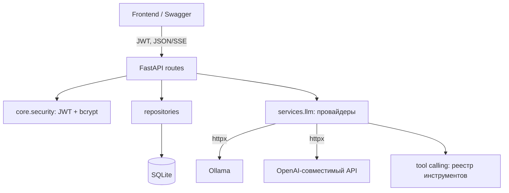

# 5 Element — Chat API (backend)

REST API для веб-чата с LLM: авторизация, чаты, история диалогов и
проксирование запросов к LLM-провайдеру (Ollama / OpenAI-совместимый API).

Стек: **Python 3.13, FastAPI, SQLAlchemy 2 (async) + SQLite, Alembic, JWT, httpx.**

---

## Архитектура

Слоёная архитектура: HTTP-роуты → репозитории (доступ к БД) → модели;
работа с LLM вынесена в отдельный сервисный слой за единым интерфейсом.



Структура пакета `src/backend`:

| Каталог          | Назначение                                                       |
|------------------|------------------------------------------------------------------|
| `core/`          | Конфигурация, движок БД, безопасность (JWT, хэш паролей)         |
| `models/`        | ORM-модели: `User`, `Chat`, `Message`                            |
| `schemas/`       | Pydantic-схемы запросов/ответов                                  |
| `repositories/`  | Доступ к данным (изоляция по пользователю)                       |
| `api/routes/`    | HTTP-эндпоинты                                                   |
| `services/llm/`  | Провайдеры LLM (Ollama, OpenAI) + tool calling                   |

---

## Конфигурация

Секреты — в `.env`, настройки LLM — в `config/llm.yaml`

`.env` (см. `.env.example`):

```env
DATABASE_URL="sqlite+aiosqlite:///./app.db"
SECRET_KEY="change-me"
ACCESS_TOKEN_EXPIRE_MINUTES=1440
LLM_CONFIG_PATH="config/llm.yaml"
LLM_API_KEY=""                     # секрет для внешних API (Ollama не нужен)
```

`config/llm.yaml` (см. `config/llm.yaml.example`):

```yaml
llm:
  provider: ollama                 # ollama | openai
  base_url: http://localhost:11434 # для Docker+Ollama: http://ollama:11434
  model: llama3
  timeout: 60
```

Смена провайдера на внешний API — поменять `provider`, `base_url`, `model`
и положить ключ в `LLM_API_KEY`.

---

## Запуск

### Вариант A. Docker

```bash
cp .env.example .env            # задайте SECRET_KEY
docker compose up --build       # API на http://localhost:8000/docs
```

С локальным Ollama в том же compose:

```bash
docker compose --profile ollama up --build
# в config/llm.yaml: base_url: http://ollama:11434
docker exec -it 5element-ollama ollama pull llama3
```

### Вариант B. Локально (Poetry)

```bash
cp .env.example .env
poetry install
poetry run alembic upgrade head          # опционально — миграции идут и при старте
poetry run uvicorn backend.main:app --reload
```

Swagger UI: <http://localhost:8000/docs>.

---

## Миграции (Alembic)

```bash
make migrate                     # alembic upgrade head
make revision m="описание"       # автогенерация миграции из моделей
```

При старте приложения миграции применяются автоматически (lifespan).

## Тесты

```bash
make test                        # или: poetry run pytest
```

---

## API

| Метод/путь                                | Описание                          |
|-------------------------------------------|-----------------------------------|
| `POST /auth/register`, `POST /auth/login` | Регистрация / вход (JWT)          |
| `GET /auth/me`                            | Текущий пользователь              |
| `GET/POST /chats`                         | Список / создание чатов           |
| `PATCH/DELETE /chats/{id}`                | Переименование / удаление         |
| `GET/POST /chats/{id}/messages`           | История / отправка сообщения      |
| `POST /chats/{id}/messages/stream`        | Ответ потоком (SSE)               |
| `POST /chats/{id}/messages/tools`         | Ответ с tool calling              |
| `GET /models`                             | Доступные модели провайдера       |
| `GET /tools`                              | Доступные инструменты             |

Все эндпоинты (кроме `register`/`login`/`health`) требуют заголовок
`Authorization: Bearer <token>`. Каждый пользователь видит только свои чаты.
